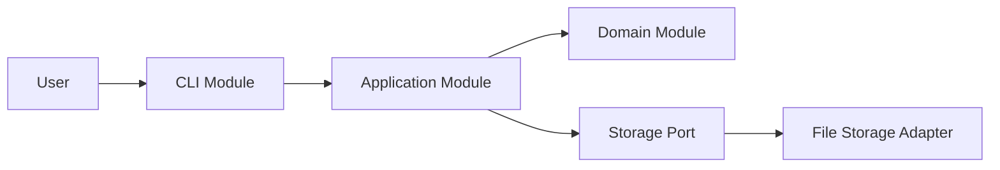
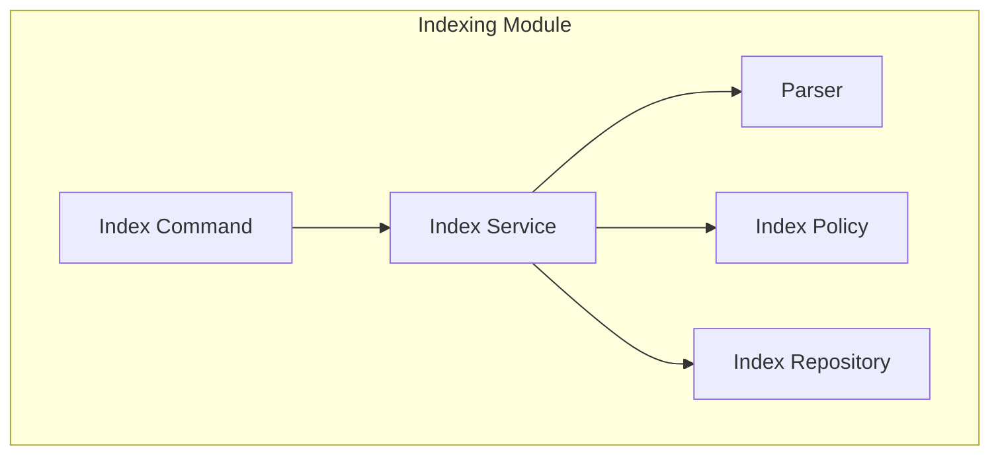
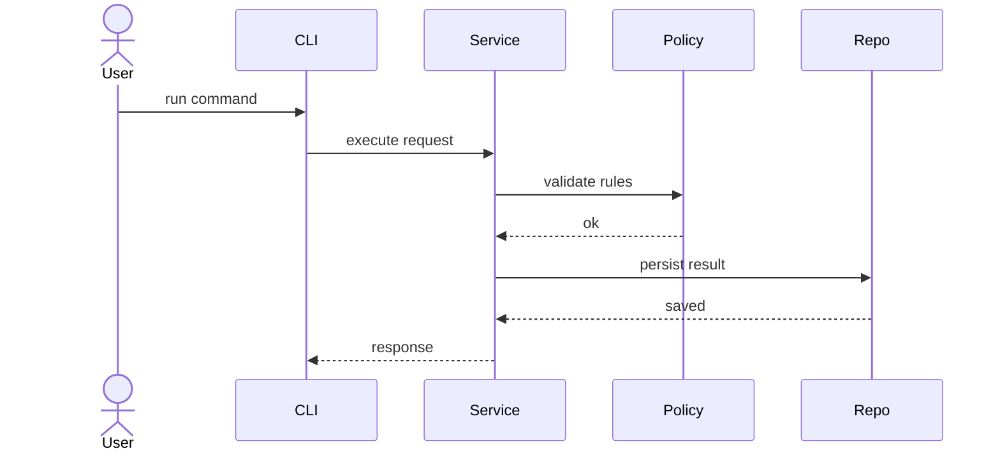

# Diagram Guidance

Diagrams are support tools. Use them only when they clarify structure faster than text or tables.

## When to use a module map

Use a module map when the reader needs to see:
- the top-level system parts
- responsibility boundaries
- dependency direction between major parts

Example:

## When to use an internal structure map

Use an internal structure map when a module contains several units that collaborate and their roles are easy to confuse.

Example:

## When to use a sequence diagram

Use a sequence diagram when call order or side effects matter.

Example:

## Diagram rules

- Keep names short and structural
- Show dependency direction clearly
- Do not mix too many concerns into one diagram
- Keep diagram labels consistent with module and file names in the tables
- If a table already explains the point better, skip the diagram

## What diagrams must not replace

A diagram must not replace:
- module ownership definition
- dependency rules
- file mapping
- public versus private boundary definition

Those must stay explicit in text or tables.
